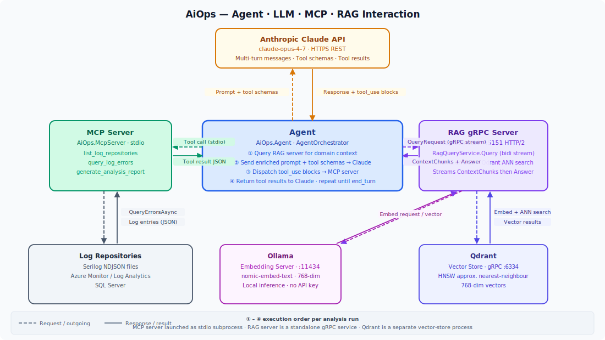

# AiOps — LLM Integration Portfolio

A mono-repo demonstrating real-world LLM integration patterns in **.NET 10**, built using Claude Code driven by a highly experienced engineer. Every architecture decision — MCP server design, agentic tool-use loops, gRPC streaming RAG pipelines — was driven by deep domain knowledge rather than generated from boilerplate prompts. This repo exists to show that the quality ceiling of AI-assisted development is set by the engineer driving it.

---

## Architecture



The diagram shows how all four components interact at runtime:

- The **Agent** enriches its prompt with domain context from the **RAG server**, then drives a multi-turn tool-use loop with the **Anthropic Claude API**
- Each `tool_use` block Claude returns is dispatched to the **MCP Server** over stdio; results feed back into the next Claude turn
- The **MCP Server** queries **Log Repositories** (Serilog files, SQL Server, Azure Monitor) and returns structured data or a full Markdown report
- The **RAG gRPC Server** uses **Ollama** embeddings and **Qdrant** vector search to ground agent prompts in relevant documentation

---

## Projects

| Project | Description |
|---|---|
| [`mcpserver/`](mcpserver/) | .NET 10 MCP server — exposes log-query tools over stdio |
| [`mcpserver.tests/`](mcpserver.tests/) | xUnit tests for the MCP server tools and repositories |
| [`agent/`](agent/) | .NET 10 Claude agent — autonomous agentic loop driving the MCP server |
| [`agent.tests/`](agent.tests/) | xUnit unit tests for the agent (72 tests, fully mocked) |
| [`rag-dotnet10/`](rag-dotnet10/) | .NET 10 RAG gRPC service — bidirectional streaming, Qdrant + Ollama + Claude |

---

### [`mcpserver/`](mcpserver/)

A [Model Context Protocol](https://modelcontextprotocol.io) server that gives an LLM structured access to application log repositories. It filters, structures, and aggregates log data before returning it to the model — the model sees patterns and summaries, not raw log dumps.

**Tools exposed:**

| Tool | Description |
|---|---|
| `list_log_repositories` | Discover all configured log sources |
| `query_log_errors` | Return structured JSON for interactive exploration |
| `generate_analysis_report` | Produce a full Markdown report with timelines, grouped stack traces, and fix-recommendation template |

**Log backends:** Serilog CLEF files · SQL Server / PostgreSQL / MySQL / SQLite · Azure Monitor Log Analytics

See [`mcpserver/README.md`](mcpserver/README.md) for full configuration and security guidance.

---

### [`agent/`](agent/)

A .NET 10 console app that runs Claude as an autonomous log-analysis agent. It spawns the MCP server as a subprocess, drives a tool-use loop until the model returns `end_turn`, and writes a structured JSON result file for each run.

Supports **one-shot mode** (useful in CI) and **periodic mode** (runs on a configurable schedule).

See [`agent/README.md`](agent/README.md) for setup and configuration.

---

### [`rag-dotnet10/`](rag-dotnet10/)

A headless gRPC service implementing a RAG pipeline over a Qdrant vector store. AI agents open a bidirectional stream, send questions, and receive streamed context chunks followed by a Claude-generated answer for each question.

**Pipeline:** Ollama embed → Qdrant ANN search → Claude generation → streamed response

See [`rag-dotnet10/README.md`](rag-dotnet10/README.md) for Qdrant and Ollama setup instructions.

---

### [`agent.tests/`](agent.tests/) · [`mcpserver.tests/`](mcpserver.tests/)

xUnit test projects covering both core projects. The Anthropic SDK and MCP infrastructure are replaced by mocks so the 72 agent tests run without network calls or live processes. The MCP server tests cover log repository implementations, report generation, and tool wiring.

```bash
dotnet test          # from repo root — runs all tests via the solution
```

---

## End-to-end integration test

[`Test-AgentIntegration.ps1`](Test-AgentIntegration.ps1) exercises the real Anthropic API end-to-end: builds both projects, runs the agent in one-shot mode, and asserts ~18 properties of the resulting JSON output file.

```powershell
$env:ANTHROPIC_API_KEY = "sk-ant-api03-..."
.\Test-AgentIntegration.ps1

# Options
.\Test-AgentIntegration.ps1 -SkipBuild -KeepOutput -TimeoutSeconds 120
.\Test-AgentIntegration.ps1 -Model "claude-3-5-haiku-20241022" -MaxTokensPerTurn 2048
```

**Prerequisites:** PowerShell 7+, .NET SDK 10, valid `ANTHROPIC_API_KEY`.

---

## Repository layout

```
aiops/
├── README.md                           # this file
├── MCP_SECURITY.md                     # deep dive: MCP security threat model and mitigations
├── architecture.svg                    # system-interaction diagram
├── AiOps.McpServer.sln                 # solution — all four projects
├── Test-AgentIntegration.ps1           # PowerShell end-to-end integration test
├── mcpserver/                          # .NET 10 MCP server
├── mcpserver.tests/                    # xUnit tests for the MCP server
├── agent/                              # .NET 10 Claude agent
├── agent.tests/                        # xUnit tests for the agent (72 tests)
└── rag-dotnet10/                       # .NET 10 RAG gRPC service
```

---

## MCP Security

[`MCP_SECURITY.md`](MCP_SECURITY.md) is a standalone deep dive into the MCP security landscape as of 2026: the threat model (prompt injection, tool poisoning, auth gaps, path traversal, privilege escalation via chaining), what the official spec says about its own limitations, the historical parallel to other ecosystem security failures, and a concrete defensive architecture — including the Docker image pattern, thin scoped wrappers, pre-deploy checklists, and runtime controls.

The core position: **only connect to MCP servers you built and control.** The only way to have a trusted server, as the spec defines it, is to be the one who built and operates it.

---

## Tech stack

| Layer | Technology |
|---|---|
| Runtime | .NET 10 (C# 13) |
| LLM | Anthropic Claude (via `Anthropic` C# SDK) |
| MCP | `ModelContextProtocol` SDK (stdio transport) |
| gRPC | `Grpc.AspNetCore` + Kestrel HTTP/2 |
| Vector store | Qdrant (via `Qdrant.Client` + Semantic Kernel connector) |
| Embeddings | Ollama (`nomic-embed-text`, 768-dim) |
| Azure integration | `Azure.Monitor.Query` + `Azure.Identity` (`DefaultAzureCredential`) |
| SQL access | Dapper + `Microsoft.Data.SqlClient` |
| Testing | xUnit 2.9 · FluentAssertions 6 · Moq 4 |
